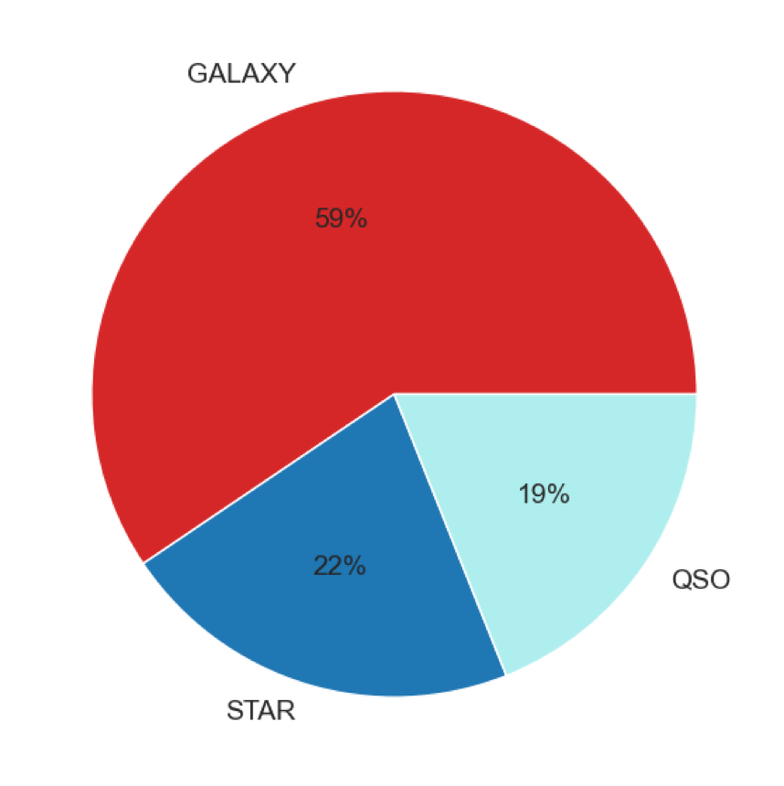
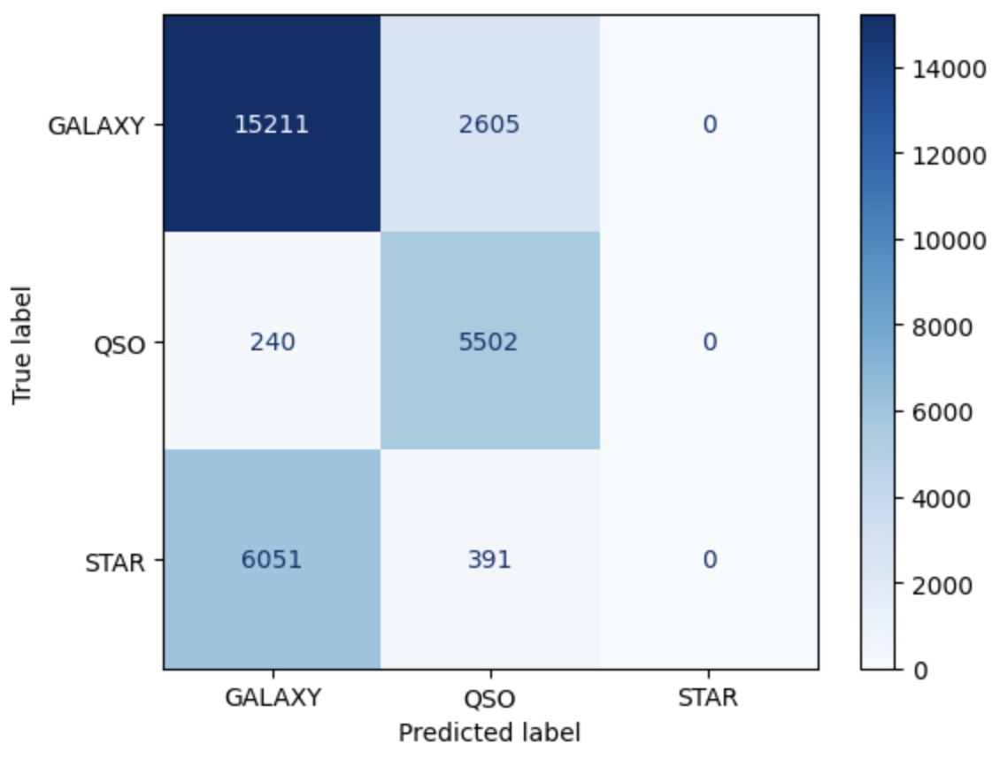
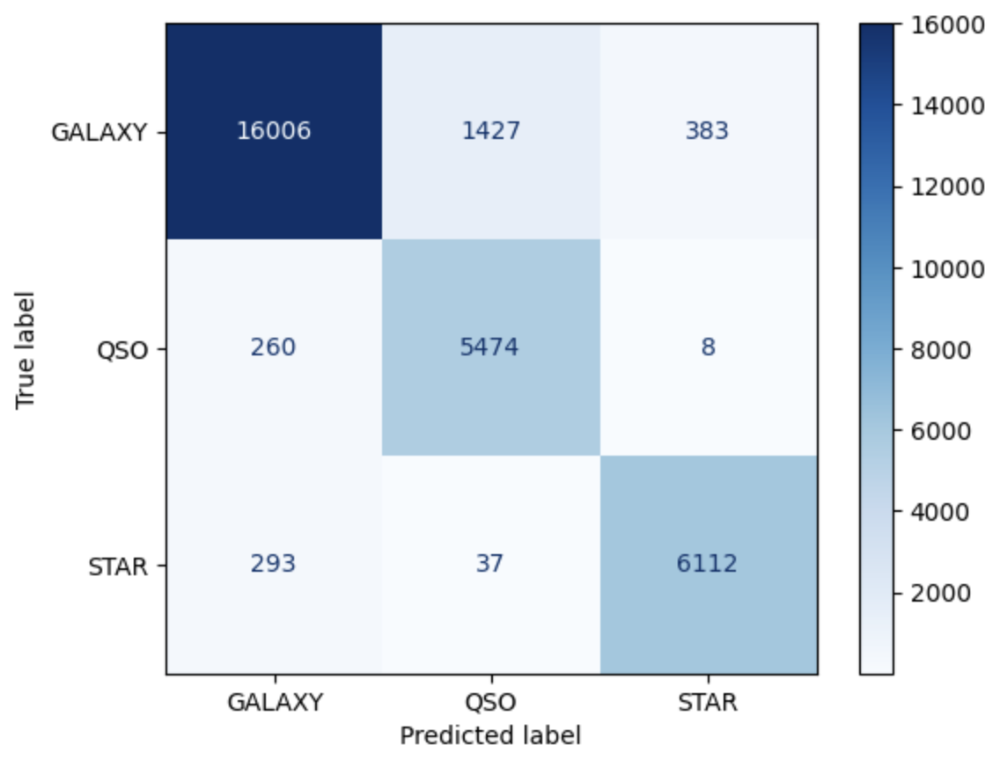
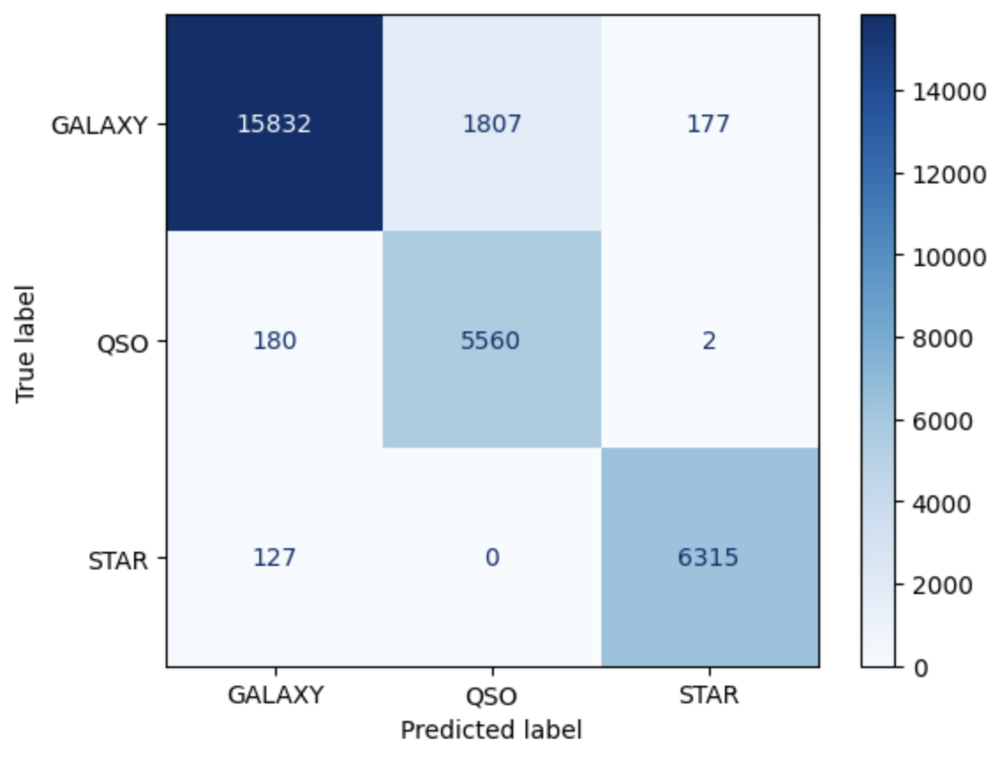

# Stellar Object Classification

## Project Overview

This project uses a neural netowrk to classify observed stellar objects into one of three classes: Star, Galaxy, or Quassar.

### Business Problem

### Identifying objects in the night sky

As humans, we have been looking up at the night sky Identifying objects in the night sky for thousands of years. We have spent ages looking for patterns and making maps of the sky hoping to get a glimpse into the history of the universe through the stars. Our human eyes can see about 10,000 stars across the night sky, however telescopes have allowed us to see and measure thousands, if not millions more. As our ability to see and measure the universe grows, our ability to identify and classify the objects in our sky grows as well.

The goal of this project is to be able to identify the stellar classification of an object based on its measurements in an effort to expand our knowledge and keep us searching the sky for answers.

Benefits:
1. More accurately classify stellar objects
2. Reduce the time it takes to identify objects
3. Allow allocation of resources to other parojects

## The Data

The data was obtained from the website Kaggle from their archive of datasets and downloaded to the local machine and included in the project GitHub. 

This dataset describes the classification of thousands of observations of stellar objects along with several features gathered during the observation.
- 100,000 observations of various stellar objects and their classification. Some feature 
    - examples are right Ascension angle, declination angle, ultraviolet filter, redshift, etc. 
- tabular format
    - 17 feature columns 
        - numerical
    - 1 class column. 
        - categorical 
- categories: star, galaxy, and quasar. 
- zero null values, 
    - making this a clean data set where all observations are anticipated to be usable. 

The data used in the project is a rating data sets published on the Kaggle website:
(https://www.kaggle.com/code/farazrahman/predicting-star-galaxy-quasar-with-svm)
The data was collected by the Sloan Digital Sky Survey.

The data is contained in the file:
- data/star_classification.csv

### Data Overview

#### Class Prevelance:

The majority of objects observed were galaxies, with the remaining observations split roughly evenly between star and QSO. This may lead to a class imbalace and can be addressed using synthetic oversampling

#### Stellar Object Locations:
The object location (from the vantage point of Earth) can be charted using two variables, alpha and delta.
- Delta:
    - declination angle 
    - equivalent to latitude, 
    - measuring the degrees from the earth's equator (horizon). The
    - equator = 0 degrees
    - poles = +- 90 degrees.
- Alpha:
    - right ascension 
    - east-west coordinate of the star, as 
    - measured by the angular distance east of the vernal equinox along the euquator.
    
All coordinates are measured by the J2000 epoch (the location of the earth's axis on January 1, 2000 at 12pm TT)

The sky is dense with objects, with density remaining fairly constent throughout the sky. Observations only start to thin out around the edges.
Color legend:
- blue: galaxies
- red: stars
- green: quasars

#### Redshift:
Red shift' occurs when a wavelength of the light is stretched, so the light is seen as 'shifted' towards the red part of the spectrum, similar to the doppler effect. As objects move away from us through space (due to teh expansion of the universe), the shift in the wavelenght can be measured and the relative motion of the object can be determined.

By plotting the redshift vs delta for each class, we can see the range of values of redshift for each class. 

- Quasars experience the most redshift, followed by galaxies, and stars which have very little red shift.
- This plot doesn't indidate a correlation between the two variables, however it demonstrates the gradient of separation between classes as redshift increases.
- There appears to be clear upper limits for redshift for each class
- Some overlap between the classes in the lower redshift values.

#### Filters:
A photomectric system is a set of optical filters with known sensitivity to specific wave lengths of the electromagnetic spectrum. When each filter is used, it is able to measure the intensity of light being emited in the filter's range. The data contains measurements from 5 different filters.
- u: UV filter
- g: green filter
- r: red filter
- i: near infrared filter
- z: inframred filter

Source: https://en.wikipedia.org/wiki/Photometric_system

## Analysis
The primary analysis work can be found in the jupityer notebook 'data_analysis.ipynb'

### Data Cleaning: 
Not much data cleaning was necessary, there were no null values in the dataset, as it was a pre-filtered and currated dataset. The only cleaning performed was to remove unnecessary columns from the individual csv files, primarily the timestamp columns and look for outliers in the columns.

### Data Preperation:
#### Normalization:
The data was normalized to a standard scale.

#### 
Due to the class imbalance, the data was reampled to create an even distribution of classes. 

### Metric Selection:
The success of the model will lie in it's ability to accurately assign a class to an object. While neither false positives or false negatives are desirable, neither outweighs the other. A metric that accounts for both equally should be used as the primary success metric.

Accuracy takes into account both false positives and false negatives by dividing the number of correctly identified observations by the total number of observations: 

### Base Model: Decision Tree

A base model was built in order to determine the baseline accuracy we can achieve with this dataset. The model used was a decision tree, and achieved an accuracy of 96%. This indicates that while there is some room for improvment, we should not expect any more that a 1-2% increase in accuracy.

The confusion matrix shows that the decision tree was very good at distingushing stars from quasars, decent at distinguishing galaxies from stars, but not as good with galaxies vs quasars. 

### Neural Netork
A neural network was selected for the final model because....

#### Single Layer Neural Netork
The first neural network built consisted of one hidden layer, which also achieved an accuracy of 96%

#### Grid Search
The ranges of values selected for each parameter during hyperparamter tuning were permutated to produce all possible combinations of parameters to search for the combination that produces the highest possible precision. 

The SVD Grid search optimal paramters produced the highest accuracy:
    - number of layers = 3
    - activation function = tanh
    - batch size = 21
    - epochs = 20
    - l2 regularization = false

#### Final Model
Using the parameters identified during the grid search, a final neural network was built and tested. The final model was able to achieve an accuracy of 97%. This indicates a small improvement from the base model, however since the orignal base model accuracy was so high, this is an acceptable amount of improvement. 

##### Final Model Confusion Matrix

We can see that the final model is better at distinguishing galaxies from quasars than be base model, and the expense of a few more galaxies and quasars being mis-identified as stars.

## Conclusion
The final trained as a three layer neural network using normalized and resampled data and optimized using a grid search of parameters. Early Stopping was employed to mitigate overfitting.

Using this final model, we are able to accurately classify objects observed in the night sky with an accuracy of 97%.

### Repository Structure
    - images Folder: images used in this ReadMe
    - data Folder: contains the original Sloan Digital Sky Survey data set, as well as the results from several sections of the grid search.
    - pdfs Folder: contains the pdfs turned in as part of this project, including the presentation
    - data_analysis.ipynb: the jupyter notebook containing the primary analyses
    
### Reproducibility
In addition to this repository, the dataset and analysis are stored on a google drive. The analysis can be run via Google Colab by accessing this link:

Link: https://drive.google.com/drive/u/0/folders/1eapYj4Yb5FCLeOsHf8pnWVVfcjhl5fni

### Contact Information

Abigail Campbell
abbycampbell0@gmail.com